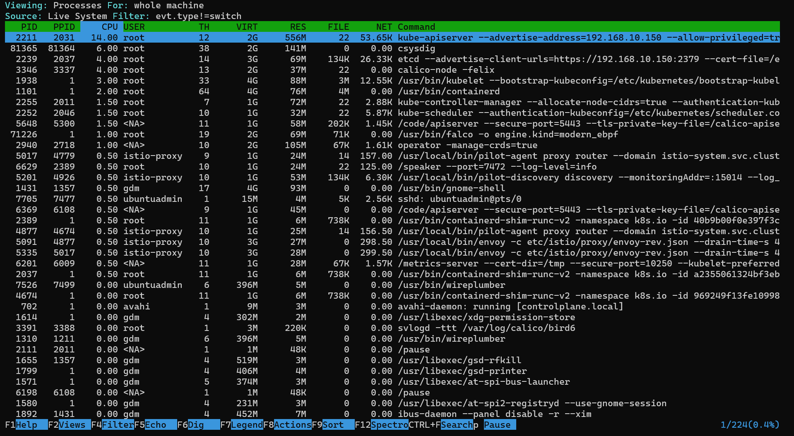

# CKS: Monitoring - Sysdig

[Back](../README.md)

- [CKS: Monitoring - Sysdig](#cks-monitoring---sysdig)
  - [Sysdig](#sysdig)
    - [Lab: sysdig](#lab-sysdig)

---

## Sysdig

- common tools for debugging

| Tools     | Purpose                            |
| --------- | ---------------------------------- |
| `strace`  | Discovering system calls           |
| `tcpdump` | Network traffic monitoring         |
| `lsof`    | Files are opened by which process. |
| `netstat` | Network Connection monitoring      |
| `htop`    | Process Monitoring                 |
| `iftop`   | Network Bandwidth monitoring       |

- Sysdig Utility comes with
  - a command line option (sysdig)
  - interface UI (csysdig)

- `sysdig’s chisels`
  - little scripts that **analyze the sysdig event** stream to perform useful actions

---

### Lab: sysdig

```sh
# ################
# install
# ################
sudo apt install -y sysdig

# ########################
# display all events
# ########################
sudo sysdig

# ########################
# show all the open system calls invoked by nano
# ########################
sudo sysdig proc.name=nano
# 83089 08:49:20.691951191 3 nano (77266.77266) < read res=1 data=.
# 83091 08:49:20.691964288 3 nano (77266.77266) > write fd=1(<f>/dev/pts/2) size=6
# 83093 08:49:20.691999992 3 nano (77266.77266) < write res=6 data=.[?25l
# 83094 08:49:20.692008777 3 nano (77266.77266) > poll fds=0:f1 timeout=0
# 83095 08:49:20.692012020 3 nano (77266.77266) < poll res=0 fds=0:f0
# 83097 08:49:20.692017874 3 nano (77266.77266) > unlink
# 83098 08:49:20.692108353 3 nano (77266.77266) < unlink res=0 path=/home/ubuntuadmin/.test.txt.swp
# 83099 08:49:20.692120764 3 nano (77266.77266) > rt_sigaction
# ...

nano ~/test.txt

# ########################
# show systemctl calls by nano or cat
# ########################
sudo sysdig proc.name=cat or proc.name=nano

# ########################
# Capture all the events from the live system and save them to disk
# ########################
sysdig -w dumpfile.scap

# ########################
# list all supported filter
# ########################
sysdig -l
# Field Class:                  evt (All event types)
# Description:                  These fields can be used for all event types
# Event Sources:                syscall

# evt.num                       event number.
# evt.time                      event timestamp as a time string that includes the nanosecond part.
# evt.time.s                    event timestamp as a time string with no nanoseconds.
# evt.time.iso8601              event timestamp in ISO 8601 format, including nanoseconds and time zone offset (in UTC).
# evt.datetime                  event timestamp as a time string that includes the date.

# ########################
# filter by: cat command in container
# ########################
# monitor
sudo sysdig proc.name=cat and container.name!=host
# 4353470 09:12:37.020148595 1 cat (84366.84366) < execve res=0 exe=cat args=/home/ubuntuadmin/test.txt. tid=84366(cat) pid=84366(cat) ptid=84039(containerd-shim) cwd=<NA> fdlimit=1024 pgft_maj=2 pgft_min=608 vm_size=440 vm_rss=0 vm_swap=0 comm=cat cgroups=cpuset=/kubepods/besteffort/pod3f2176f3-faba-4ad3-bb13-09aa89ba0216/294b99efe... env=PATH=/usr/local/sbin:/usr/local/bin:/usr/sbin:/usr/bin:/sbin:/bin.HOSTNAME=ap... tty=34816 pgid=33 loginuid=-1(<NONE>) flags=1(EXE_WRITABLE) cap_inheritable=0 cap_permitted=A80425FB cap_effective=A80425FB exe_ino=804805 exe_ino_ctime=2026-09-13 05:55:49.643101820 exe_ino_mtime=2025-06-04 11:14:05.000000000 uid=0(root) trusted_exepath=/usr/bin/cat
# ...


# behavior
kubectl run app --image nginx
# pod/app created

kubectl exec -it app -- cat ~/test.txt


# ########################
# list all chisels
# ########################
# lists the available chisels.
sudo sysdig -cl
# Category: Application
# ---------------------
# httplog.lua     HTTP requests log
# httptop.lua     Top HTTP requests
# memcachelog.lua memcached requests log

# Category: CPU Usage
# -------------------
# spectrogram.lua Visualize OS latency in real time.

# ########################
# chisels example
# ########################
# list Top processes by CPU usage
sudo sysdig -c topprocs_cpu

#  Display interactive user activity
sudo sysdig -c spy_users

# List (and optionally filter) the machine processes.
sudo sysdig -c ps

# Visualize OS latency in real time
sudo sysdig -c spectrogram


```

- csysdig

```sh
sudo csysdig
```


