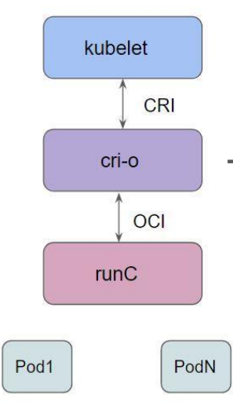

# CKS: Open Container Initiative (OCI)

[Back](../README.md)

- [CKS: Open Container Initiative (OCI)](#cks-open-container-initiative-oci)
  - [Container runtime](#container-runtime)
    - [high-level vs low-level runtime](#high-level-vs-low-level-runtime)
    - [`Container Runtime Interface (CRI)`](#container-runtime-interface-cri)
  - [Open Container Initiative (OCI)](#open-container-initiative-oci)
  - [Lab: runc demo(skip)](#lab-runc-demoskip)

---

## Container runtime

- `Container Runtimes`
  - software that **executes containers and manages** container **images** on a node
  - Popular Runtimes
    - Docker, containerd, Cri-o, Podman

---

### high-level vs low-level runtime

- `high-level runtime`
  - manages the **overall container life**cycle, including downloading (pulling) images from a registry, unpacking them, and setting up storage or networking.
  - acts as a **supervisor** that takes user or orchestrator **requests** and **passes the final execution steps** to a `low-level runtime`.
  - Examples: `containerd`, `CRI-O`, and `Docker Engine (dockerd)`

- `low-level runtime` / `OCI runtime`
  - focuses strictly on the **physical execution** of the container.
  - follows the `Open Container Initiative (OCI) standards` to directly **interact with the host operating system kernel**.
  - creates the isolated environment **using system features like** Linux `namespaces` (for process isolation) and `cgroups` (for resource limits) and starts the **process**.
  - Examples: `runc`, `crun`, and `gVisor`

---

### `Container Runtime Interface (CRI)`

- used to enable `kubelet` to use a wide variety of container runtimes without the need to recompile.

- API server
  - -> kubelet
  - -> high-level runtime(containerd)
    - pull images
    - unpack image to fs
    - generate OCI runtime spec json
    - launch OCI runtime
  - -> low level runtime(runc)



---

## Open Container Initiative (OCI)

- `Open Container Initiative (OCI)`
  - Linux Foundation project to design **open standards for containers**.

- Main Specifications
  - **Runtime Specification** (`runtime-spec`):
    - defines how to **run** the OCI image bundle as a container.
  - **Image Specification** (`image-spec`):
    - Defines how to **create an OCI Image**
      - an image manifest
      - a filesystem (layer) serialization
      - an image configuration
  - **Distribution Specification** (`distribution-spec`):
    - Standardizes the **API protocol** used to distribute and transfer container **images through registries**.

---

## Lab: runc demo(skip)

```sh
# container root
containerd --version
# containerd --versioncontainerd github.com/containerd/containerd 1.7.28

containerd config default | grep root
# root = "/var/lib/containerd"

# create and run a container
runc run demo-container


ctr --namespace k8s.io images pull nginx:latest

```
