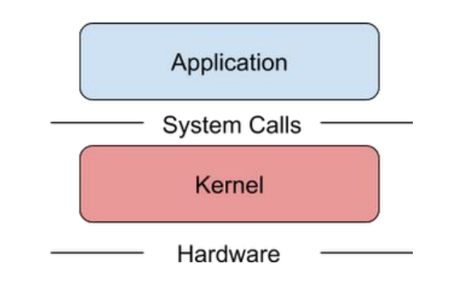
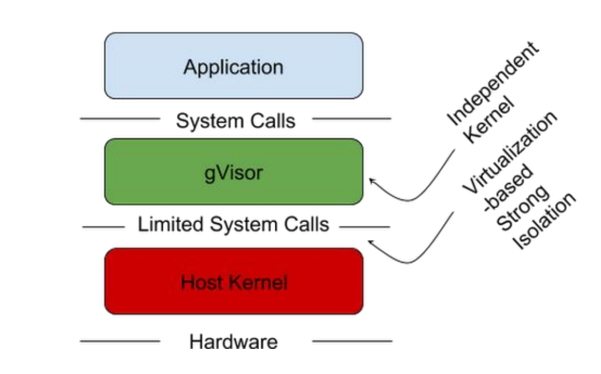

# CKS: Runtime - Sandbox

[Back](../README.md)

- [CKS: Runtime - Sandbox](#cks-runtime---sandbox)
  - [Sandbox](#sandbox)
  - [`gVisor`](#gvisor)
  - [Sandbox with k8s: `RuntimeClass`](#sandbox-with-k8s-runtimeclass)
  - [Lab: `RuntimeClass`](#lab-runtimeclass)
    - [Install `runsc` on worker node](#install-runsc-on-worker-node)
    - [Create RuntimeClass](#create-runtimeclass)
    - [Apply](#apply)

---

## Sandbox

- Tradition:
  - Linux `containers` **access system resources** in the same way as the regular (non-containerized) applications do:
    - by making system **calls directly** to the `host kernel`.
  - risk of being leverage the host kernel from container



- `Seccomp (secure computing mode)`
  - a Linux kernel **security feature** that **restricts** the `system calls` a process can make.
    - a **filter** between `user-space` applications and the `Linux kernel`.
    - controls `syscalls`, limits what an attacker can do if a process or container is compromised.

  - disadvantage:
    - require the user to create a **predefined whitelist** of `system calls`.
    - In practice, it’s often **difficult to know** which `system calls` will be required by an application **beforehand**.

---

- `Container Sandbox`
  - a secure, **isolated environment** used to run **untrusted** code, applications, or AI agents without risking the host operating system.
    - use **lightweight** `microVMs (micro virtual machines)` to enforce **hardware-level security**.
    - restrict access to memory, CPU, networking, and the host file system

---

## `gVisor`

- `gVisor`
  - an open-source `sandboxed container runtime` developed by Google that provides a strong security isolation layer between running applications and the host operating system
  - runs a **dedicated user-space kernel** for each sandbox
    - `Sentry`: the core component intercepts application `system calls` and handles them in `user space`
    - `Gofer`: unprivileged sidecar process handles file operations securely using the 9P protocol



- `runsc (run sandboxed container)`
  - the` Open Container Initiative (OCI)` **runtime** for `gVisor`

- Common use case:
  - Generally organization makes use of sandboxes like `gVisor` for the applications that are **not entirely trusted**
  - e.g., cloning repo from GitHub and running that application

---

## Sandbox with k8s: `RuntimeClass`

- ref: https://kubernetes.io/docs/concepts/containers/runtime-class/

- `RuntimeClass`
  - a Kubernetes **cluster-scoped resource** used to **select** different `container runtime` configurations for running pods.
  - maps a **friendly name** to a specific **container runtime handler** configured on your nodes
    - e.g.,such as runc, gVisor, or Kata Containers.

---

## Lab: `RuntimeClass`

### Install `runsc` on worker node

```sh
# #####################
# Download on worker node
# #####################
# Add the gVisor GPG key
curl -fsSL https://gvisor.dev/archive.key | sudo gpg --dearmor -o /usr/share/keyrings/gvisor-archive-keyring.gpg

# Add the repository
echo "deb [arch=$(dpkg --print-architecture) signed-by=/usr/share/keyrings/gvisor-archive-keyring.gpg] https://storage.googleapis.com/gvisor/releases release main" | sudo tee /etc/apt/sources.list.d/gvisor.list > /dev/null

# Install runsc
sudo apt-get update && sudo apt-get install -y runsc

# #####################
# Configure Containerd
# #####################
cat <<EOF | sudo tee /etc/containerd/config.toml
version = 2
[plugins."io.containerd.runtime.v1.linux"]
  shim_debug = true
[plugins."io.containerd.grpc.v1.cri".containerd.runtimes.runc]
  runtime_type = "io.containerd.runc.v2"
[plugins."io.containerd.grpc.v1.cri".containerd.runtimes.runsc]
  runtime_type = "io.containerd.runsc.v1"
EOF

sudo systemctl restart containerd
sudo systemctl status containerd
```

---

### Create RuntimeClass

```sh
# control plane
cat <<EOF | kubectl apply -f -
apiVersion: node.k8s.io/v1
kind: RuntimeClass
metadata:
  name: gvisor
handler: runsc
EOF
# runtimeclass.node.k8s.io/gvisor created

kubectl get runtimeclass
# NAME     HANDLER   AGE
# gvisor   runsc     10s

kubectl describe runtimeclass gvisor
# Name:         gvisor
# Namespace:
# Labels:       <none>
# Annotations:  <none>
# API Version:  node.k8s.io/v1
# Handler:      runsc
# Kind:         RuntimeClass
# Metadata:
#   Creation Timestamp:  2026-09-11T08:25:29Z
#   Resource Version:    136092
#   UID:                 947ebd6c-97e1-4ed6-aa49-d60e0050aa44
# Events:                <none>
```

---

### Apply

```sh
# app runtime: gvisor
cat <<EOF | kubectl apply -f -
apiVersion: v1
kind: Pod
metadata:
  name: app-gvisor
spec:
  runtimeClassName: gvisor
  containers:
  - name: nginx
    image: nginx
EOF
# pod/app-gvisor created

# app runtime: default
cat <<EOF | kubectl apply -f -
apiVersion: v1
kind: Pod
metadata:
  name: app-default
spec:
  containers:
  - name: nginx
    image: nginx
EOF
# pod/app-default created

kubectl get po -o wide
# NAME          READY   STATUS    RESTARTS   AGE   IP               NODE     NOMINATED NODE   READINESS GATES
# app-default   1/1     Running   0          5s    10.244.196.147   node01   <none>           <none>
# app-gvisor    1/1     Running   0          10s   10.244.196.146   node01   <none>           <none>

# #################################
# validate
# #################################
# get host kernel info of worker node
uname -r
# 6.14.0-37-generic

# get kernel info of default
kubectl exec -it app-default -- uname -r
# 6.14.0-37-generic

# get kernel info of gvisor
kubectl exec -it app-gvisor -- uname -r
# 4.19.0-gvisor

# get diagnosis info of gvisor
kubectl exec -it app-gvisor -- dmesg
# [    0.000000] Starting gVisor...
# [    0.305974] Synthesizing system calls...
# [    0.802344] Waiting for children...
# [    1.005304] Daemonizing children...
# [    1.009125] Politicking the oom killer...
# [    1.150616] Singleplexing /dev/ptmx...
# [    1.547264] Granting licence to kill(2)...
# [    1.570438] Generating random numbers by fair dice roll...
# [    1.848719] DeFUSEing fork bombs...
# [    2.126055] Segmenting fault lines...
# [    2.341102] Checking naughty and nice process list...
# [    2.346978] Ready!

```

- clean up

```sh
kubectl delete po --all

kubectl delete runtimeclass gvisor
```
